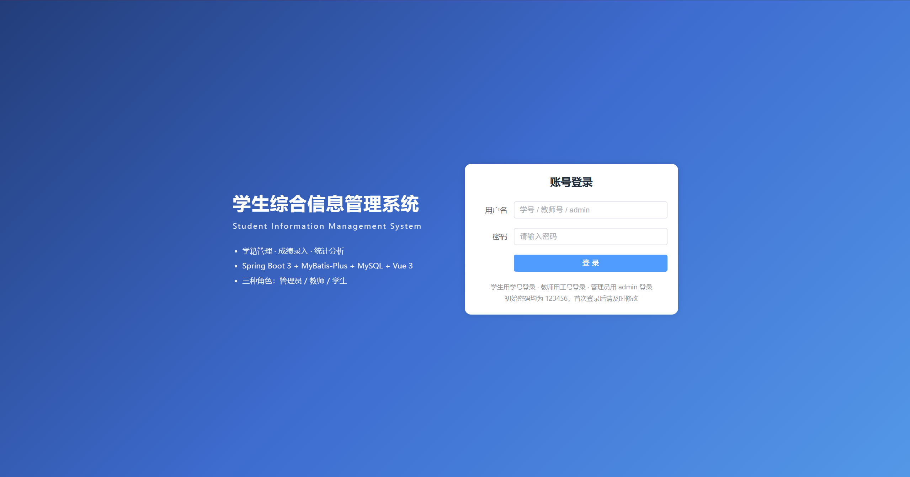
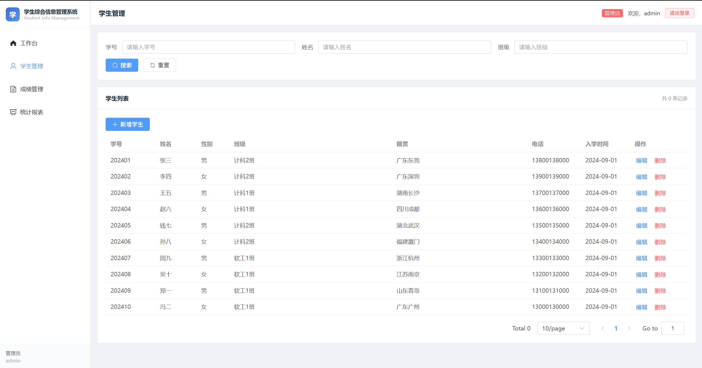
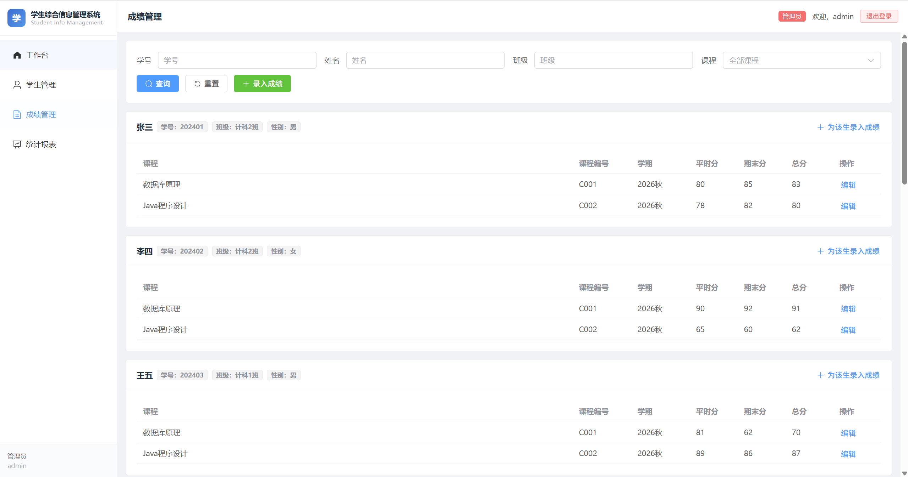
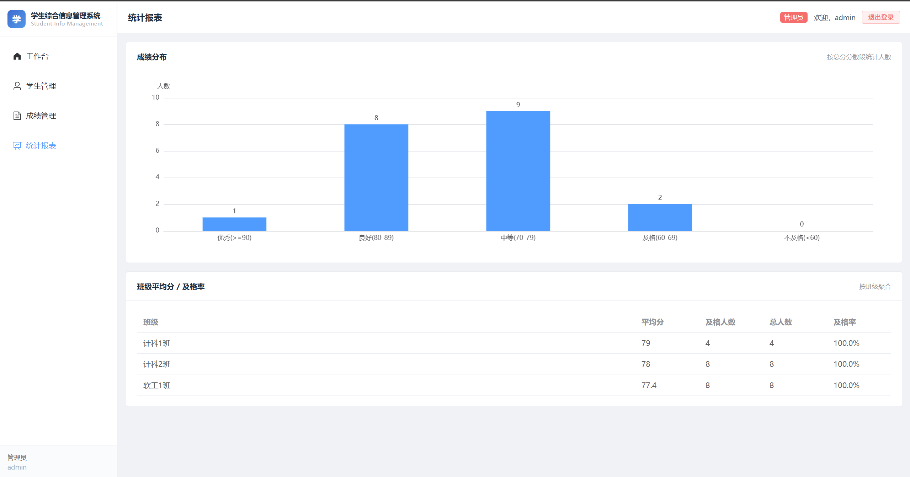

# 学生综合信息管理系统 · Web 前端（Vue3 + Element Plus）

> 前后端分离 · 管理后台 · 角色动态菜单
>
> 🌐 **在线演示：** http://47.98.192.161
> （用户名 `admin` / 密码 `123456`）
> （用户名 `T001` / 密码 `123456`）
> （用户名 `202401` / 密码 `123456`）

## 项目简介

基于 Vue3 + Vite + Element Plus 开发的管理后台，通过 Axios 调用后端 RESTful 接口，实现登录、学生管理、成绩管理、统计报表等功能。使用 Vue Router 做路由守卫，Pinia 管理用户状态，Axios 拦截器自动携带 JWT Token。

## 技术栈

- Vue3（Composition API）
- Vite
- Element Plus
- Vue Router
- Pinia
- Axios
- ECharts

## 功能页面

- 登录页（JWT 登录）
- 布局页（侧边菜单按角色动态显示）
- 学生管理（分页、搜索、新增、编辑、删除）
- 成绩管理（查询、录入、修改）
- 统计报表（成绩分布、班级平均分）

## 项目截图

### 登录页


### 学生管理


### 成绩管理


### 统计报表


## 项目结构

```
src/
├── api/          # 接口封装
├── components/   # 公共组件（Layout）
├── router/       # 路由配置
├── store/        # Pinia 状态管理
├── utils/        # Axios 封装
└── views/        # 页面组件
```

## 如何运行

1. 确保已安装 Node.js 18+
2. 安装依赖：
   ```bash
   npm install
   ```
3. 启动开发服务器：
   ```bash
   npm run dev
   ```
4. 浏览器访问 `http://localhost:5173`

> 注意：需要先启动后端服务（默认 `http://localhost:8080`），Vite 已配置代理 `/api` → `http://localhost:8080`。

## 默认账号

| 角色 | 用户名 | 密码 |
|---|---|---|
| 管理员 | admin | 123456 |
| 教师 | T001 | 123456 |
| 学生 | 202401 | 123456 |

## 部署

- 前端打包：`npm run build`，产出 `dist/` 目录
- 部署于阿里云 ECS，Nginx 提供静态文件服务并反向代理 `/api`
- 在线地址：http://47.98.192.161

## 作者

- 李林罡
- GitHub：[angnury](https://github.com/angnury)